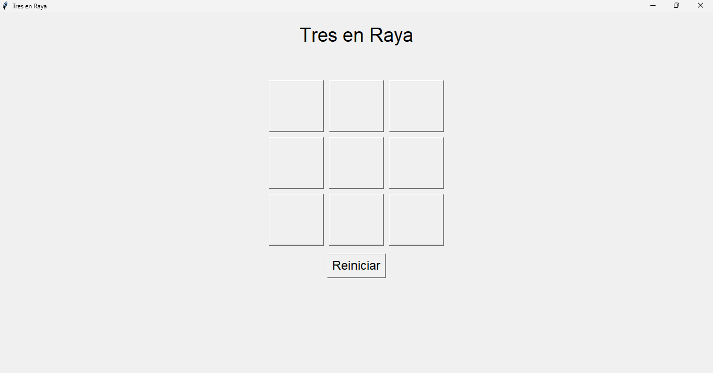
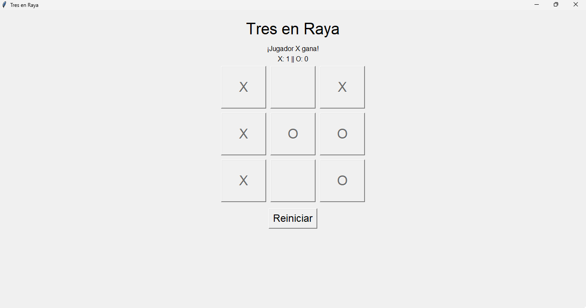
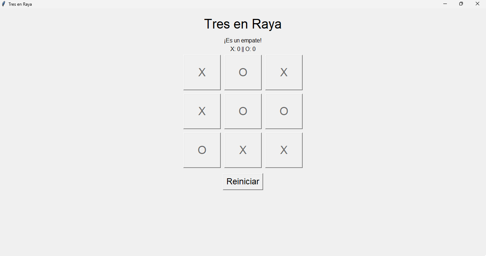

# Tres en Raya
Este es un juego de Tres en Raya implementado en Python utilizando la biblioteca Tkinter para la interfaz gráfica de usuario (GUI).

## Descripción
El Tres en Raya es un juego de estrategia para dos jugadores. El tablero es una cuadrícula de 3x3 donde los jugadores colocan alternativamente sus fichas ('X' y 'O') en las celdas vacías. El objetivo del juego es hacer una línea de tres fichas del mismo tipo en cualquier dirección: horizontal, vertical o diagonal.

## Funcionalidades
- Juego para dos jugadores: 'X' y 'O'.
- Visualización del tablero en una interfaz gráfica simple.
- Detección automática de victorias y empates.
- Contador de victorias para cada jugador.
- Opción para reiniciar el juego en cualquier momento.

### Capturas de pantalla






### Requisitos

- Python 3.x
- Tkinter (generalmente viene incluido con la instalación de Python)

## Instrucciones de uso

1. Clona o descarga este repositorio en tu máquina local.
1. Abre una terminal y navega hasta el directorio donde se encuentra el archivo **tresenraya.py**.
1. Ejecuta el script **tresenraya.py** con Python:

```bash
 python tresenraya.py
```

4. Disfruta del juego.


### Contribuciones

Las contribuciones son bienvenidas. Si tienes alguna sugerencia de mejora, funcionalidad adicional o encuentras algún error, no dudes en abrir un issue o enviar un pull request.

### Créditos
Este juego fue creado por [Cristian Arias] como parte de [Desafío].

Licencia
Este proyecto está bajo la Licencia [Nombre de la Licencia]. Para más información, consulta el archivo LICENSE.

